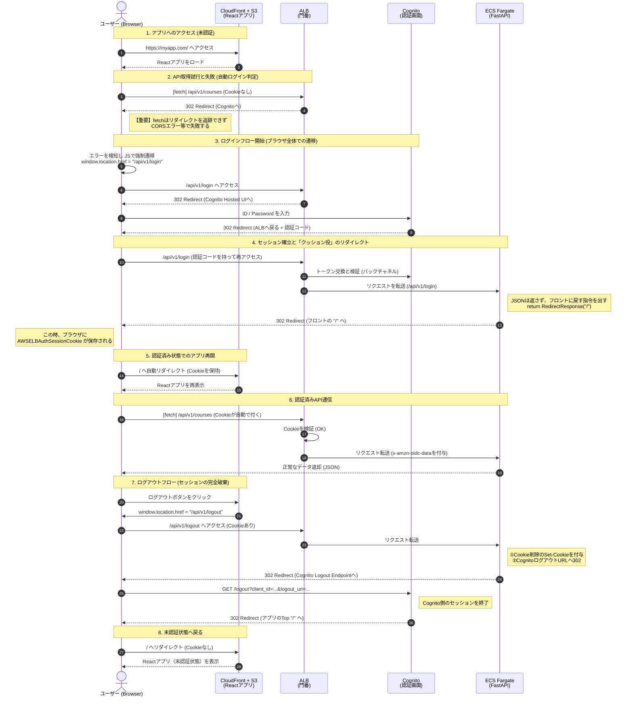

# 認証フロー

## シーケンス図

## フェーズ1：認証（ログインして「鍵」をもらう）

AWSのインフラ（ALB + Cognito）が複雑な認証処理を代行する。Reactアプリ側では、認証が必要な際に「ブラウザごと特定の場所へ移動させる」というシンプルな指示だけで完結する。

1. ログインの開始
    
    Reactアプリは、APIリクエストのエラー（認証切れ）を検知すると、ユーザーを ログイン専用エンドポイント（例: /api/v1/login） へブラウザごと遷移させる。
    
    > 注意：fetch や axios ではALBのリダイレクトを処理できないため、window.location.href を使用する。
    > 
2. ALBによる誘導
    
    ALBは /api/v1/login へのアクセスをインターセプトし、未認証であればCognitoのHosted UI（AWS標準のログイン画面）へリダイレクトする。
    
3. Cognitoでのユーザー認証
    
    ユーザーはAWSの画面でIDとパスワードを入力する。認証成功後、Cognitoは「認証コード」を付与してユーザーを再びALBへ戻す。
    
4. セッション確立と「クッション役」によるリダイレクト
    - ALBの処理：裏側でCognitoと通信してトークンを取得し、ブラウザにセッションCookie（`AWSELBAuthSessionCookie`）を発行・保存させる。
    - FastAPIの処理（重要）：ALBからリクエストを転送されたFastAPI（`/api/v1/login`）は、「フロントエンドのトップ画面（`/`）に戻れ」というリダイレクト命令（302）を返す。
    - これで、ブラウザのURLがAPIのパスからReactアプリのパスへ正常に戻る。

## フェーズ2：APIリクエスト（「鍵」を見せて通してもらう）

一度認証が完了すれば、ブラウザの標準機能とALBが連携するため、React側で認証を意識した特別なコードを書く必要はほとんどない。

### **ステップA：React側でのリクエスト作成**

Reactコード内では、`Authorization` ヘッダーなどを手動でセットする必要はない。ブラウザが自動的に、保存されている Cookie (`AWSELBAuthSessionCookie`) をリクエストに添付して送信する。

### **ステップB：ネットワーク通過（CloudFront & ALB）**

1. リクエストは `https://myapp.com/api/v1/...` へ送信される。
2. CloudFrontの役割：
    
    パスに基づいてALBへ転送する。この際、CloudFront側で Cookieを透過（Forward）する設定にしておく必要がある。そうしないと、ALBに届く前に「鍵」が捨てられ、無限ログインループに陥る。
    

### **ステップC：ALBでの検証とFastAPIへの引き渡し**

「門番」であるALBが、届いたCookieの有効性をチェックする。

1. 検証OK：Cookie内の情報を復号し、ユーザー属性（JWT）を `x-amzn-oidc-data` ヘッダーに格納してFastAPIへ転送する。
2. 検証NG（期限切れ等）：FastAPIには通さず、再度ログインフロー（ステップ1）へリダイレクトさせる。

### **ステップD：FastAPIでのデータ処理**

FastAPIには「信頼できる門番（ALB）」がチェック済みのリクエストのみが届く。

- バックエンド側では、複雑な署名検証の実装は不要だが、ゼロトラストの観点で行うことも可能。
- ヘッダーの `x-amzn-oidc-data` からユーザーを特定し、ビジネスロジックを実行してJSONを返す。

## 実装時にハマりやすいポイント（注意点）

### 1. SPA特有の「リダイレクトの壁」

Reactから `axios` や `fetch` でAPIを叩いた際、未認証だとALBは「302 Redirect」を返しますが、JavaScriptの非同期通信（Ajax）はセキュリティ上の制限でこのリダイレクトを自動追跡できず、エラーとなる。

- 対策：APIエラーをキャッチし、`window.location.href = "/api/v1/login"` でブラウザ全体を動かす実装が必須。

### 2. クッション役エンドポイントの不在

認証後に直接API（JSON）へ戻すと、ブラウザ画面がJSONの文字だけで埋まって止まってしまう。

- 対策：必ず「フロントエンドのURLへリダイレクトして戻す」だけのFastAPIエンドポイント（例: `/api/v1/login`）をクッションとして用意する必要がある。

### 3. ログアウトの整合性

ブラウザのCookieを消去するだけでは、ALBやCognito側にセッションが残る場合がある。

- 対策：ログアウト時は、Cognitoのログアウトエンドポイント（`https://[domain]/logout?...`）へユーザーをリダイレクトさせ、AWS側のセッションも確実に終了させる必要がある。
