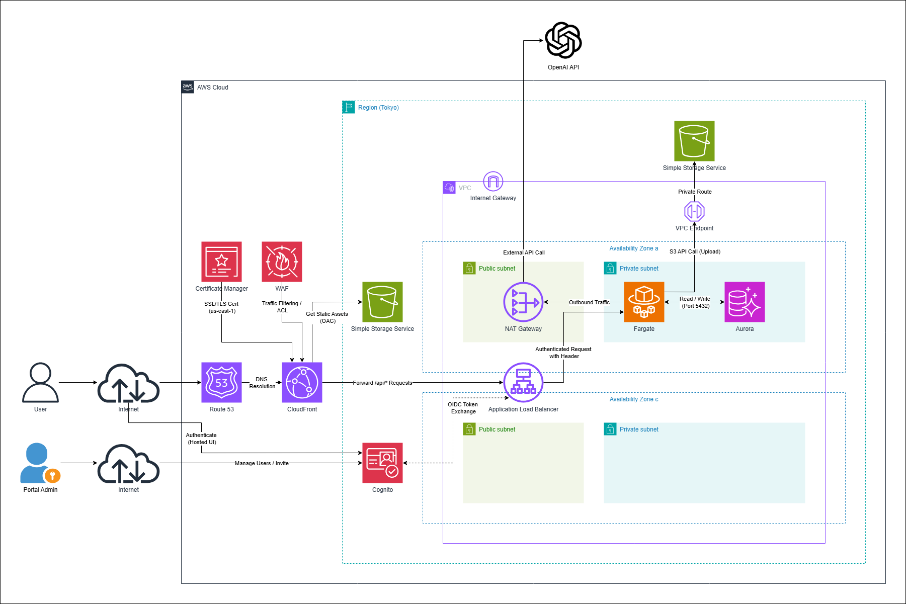

# AWS 構成

## 構成図

## アーキテクチャ概要

### 招待制 React + FastAPI アプリケーション

本システムは、フロントエンドにReact、バックエンドにFastAPIを採用したサーバーレス・コンテナアーキテクチャである。データベースには高性能な **Amazon Aurora** を採用し、バックエンドから **外部LLM API** と連携することで生成AI機能を実装する。
認証・認可プロセスをAWSマネージドサービス（ALB）にオフロードすることで、アプリケーションの実装負荷を軽減し、堅牢なセキュリティを実現している。

### 1. エントリーポイントとルーティング（入り口）

ユーザーからのアクセスは全て、CDNである **Amazon CloudFront** が一元的に受け付ける。**Amazon Route 53** により、ユーザーは単一の独自ドメイン（例: `https://myapp.com`）でアクセスする。

CloudFrontはURLのパスに基づいてリクエストを振り分けると共に、**認証に必要なCookieをバックエンドへ透過**させる。

- **静的コンテンツ（Web画面）**：パスが `/api` 以外の場合、CloudFrontは **Amazon S3** に保存されたReactのビルドファイルを高速に配信する。
- **APIリクエスト**：パスが `/api/*` の場合、CloudFrontはリクエストをバックエンドの **Application Load Balancer (ALB)** へ転送する。

### 2. 認証・認可の仕組み（セキュリティ）

**Amazon Cognito** と **ALB** を連携させた、招待制のセキュリティモデルを採用する。認証ロジックをアプリケーションからインフラ層へ移動させているのが特徴である。認証フローの詳細は [auth-flow.md](./auth-flow.md) を参照。

- **ユーザー管理**：管理者がメールアドレスを登録して招待したユーザーのみが利用可能（自己登録は不可）。
- **認証のオフロード（ALB認証）**
    - バックエンドへのAPIリクエストは、まず **ALB** がインターセプトし、セッションCookieの検証を行う。
    - 未認証のユーザーは、ALBによって自動的にCognitoのログイン画面（Hosted UI）へリダイレクトされる。
    - 認証成功後、ALBはユーザー情報をHTTPヘッダー（`x-amzn-oidc-data` 等）に付与してFastAPIへ転送する。
    - FastAPI側では、付与されたヘッダー情報を参照するだけでユーザーを特定でき、複雑なトークン検証ロジックを実装する必要がない。

### 3. バックエンドのネットワーク構成（VPC設計）

バックエンドリソースは **Amazon VPC（仮想ネットワーク）** 内に配置し、インターネットとの通信経路を厳格に管理する。

> **Note:** ALBの仕様要件を満たすため、ネットワーク構成としては2つのAZ（Availability Zone a / c）を利用し、各AZにパブリックおよびプライベートサブネットを構築している。一方で、実行リソースおよびマネージドサービスについては、現時点ではコスト最適化および構成簡略化を優先し、1つのAZのみに配置している。

- **パブリックサブネット（公開領域）**
    - **ALB**：CloudFrontからのリクエストを受け取る「認証の門番」として機能する。Cognitoと連携して認証を行い、許可されたリクエストのみを内部へ流す。
    - **NAT Gateway**：内部のコンテナが「外部のLLM API」へアクセスするための**インターネット出口**として機能する。
- **プライベートサブネット（非公開領域）**
    - **ECS Fargate (FastAPI)**：アプリケーションロジックを実行するコンテナ。ALBによって認証済みのリクエストのみを処理する。必要に応じて **NAT Gatewayを経由して外部LLM APIへリクエストを送信**する。
    - **Amazon Aurora**：業務データを保存するリレーショナルデータベース。ECSコンテナからの接続のみを許可し、高い可用性とパフォーマンスを提供する。

### 4. 外部サービス連携（LLM）

バックエンドのFastAPIは、生成AI機能を提供するために外部LLMのAPI（OpenAI API）と通信を行う。この通信は、プライベートサブネットから **NAT Gateway** を経由して行われるため、コンテナ自体のIPアドレスを外部に公開することなく、安全にAPI連携を実現する。

### 5. この構成のメリット

- **認証の実装コスト削減とセキュリティ向上**：認証処理をALBに任せることで、バックエンドのコード（JWT検証処理など）を削除・簡素化できる。また、AWSのマネージドなセキュリティ機能により、実装ミスによる脆弱性リスクを低減できる。
- **高セキュリティ & 単一ドメイン**：CloudFrontによる通信の保護、VPCによる重要リソースの隠蔽に加え、ALBによる不正アクセスの事前ブロックを実現している。
- **生成AI対応**：NAT Gatewayを配置することで、セキュアな環境を維持したまま外部のAIサービスと連携可能である。
- **高性能データベース**：Amazon Auroraを採用することで、データ規模の拡大に柔軟に対応できるパフォーマンスと可用性を確保している。

## リージョンとネットワーク

- **リージョン**: Tokyo (ap-northeast-1)
- **VPC**: 2 AZ 構成 (Availability Zone a / c)
  - ALB の仕様要件として 2 AZ が必須のため、各 AZ にパブリック・プライベートサブネットを構築
  - 実行リソース (Fargate, Aurora 等) はコスト最適化のため現時点では 1 AZ のみに配置
- **サブネット構成**:
  - Public subnet: ALB、NAT Gateway を配置
  - Private subnet: ECS Fargate、Aurora を配置

## 利用 AWS サービス一覧

| サービス | 用途 | 備考 |
|---|---|---|
| Route 53 | DNS 解決 | ドメインから CloudFront へルーティング |
| CloudFront | CDN / リバースプロキシ | 静的アセット配信 (S3 OAC) + API リクエスト転送 (`/api*` → ALB)、認証 Cookie の透過 |
| WAF | トラフィックフィルタリング / ACL | CloudFront に適用 |
| Certificate Manager | SSL/TLS 証明書管理 | CloudFront 用 (us-east-1) |
| ALB | 認証ゲートウェイ / ロードバランサー | Cognito 連携で OIDC 認証をオフロード、Public subnet に配置 |
| Amazon Cognito | ユーザー認証 (OIDC) | 招待制、Hosted UI によるログイン、管理者によるユーザー招待 |
| ECS Fargate | コンテナ実行基盤 | API サービスと Celery Worker の 2 サービス構成、Private subnet に配置 |
| ECR | Docker イメージレジストリ | GitHub Actions から push |
| Aurora (PostgreSQL) | メインデータベース | Private subnet に配置、Port 5432 |
| ElastiCache (Redis) | Celery ブローカー / 結果バックエンド | メッセージキューとタスク結果の保存 |
| S3 | ファイルストレージ / 静的アセット配信 | アップロード CSV の保存 (VPC Endpoint 経由) + React ビルドファイル配信 (OAC 経由) |
| NAT Gateway | アウトバウンド通信 | Fargate から外部 LLM API (OpenAI API) への通信に使用 |
| VPC Endpoint | プライベート接続 | Fargate → S3 への通信をプライベートルートで実現 |
| Internet Gateway | インターネット接続 | VPC のインターネットアクセス |
| IAM | アクセス制御 | ECS タスクロールで各サービスへアクセス |
| CloudWatch Logs | ログ管理 | ECS タスクのログ出力先 |

## 各サービスの詳細

### Route 53 + CloudFront + WAF

- Route 53 がドメインの DNS 解決を行い、CloudFront にルーティング
- CloudFront が URL パスに基づいてリクエストを振り分け:
  - `/api*` パス → ALB へ転送 (認証 Cookie を透過)
  - それ以外 → S3 から OAC (Origin Access Control) 経由で React ビルドファイルを取得
- WAF が CloudFront の前段でトラフィックフィルタリング / ACL を適用
- Certificate Manager (us-east-1) が CloudFront 用の SSL/TLS 証明書を管理

### ALB + Cognito (認証フロー)

ALB が Cognito と連携し、招待制の OIDC 認証を実現する。認証フローの詳細は [auth-flow.md](./auth-flow.md) を参照。

1. CloudFront が `/api*` リクエストを ALB に転送
2. ALB がセッション Cookie を検証（`AWSELBAuthSessionCookie`）
3. 未認証の場合、ALB が自動的に Cognito Hosted UI のログイン画面にリダイレクト
4. 認証成功後、ALB が以下のヘッダーをバックエンドに注入:
   - `x-amzn-oidc-identity`: Cognito Sub (ユーザー識別子)
   - `x-amzn-oidc-data`: JWT (ユーザー情報を含む)
   - `x-amzn-oidc-accesstoken`: アクセストークン
5. FastAPI の `AuthMiddleware` がヘッダーを参照してユーザーを特定（複雑なトークン検証は不要）

管理者は Cognito コンソールからメールアドレスを登録してユーザーを招待する（自己登録は不可）。

### ECS Fargate

2 つのサービスを Fargate 上 (Private subnet) で実行する。

| サービス | コマンド | 役割 |
|---|---|---|
| API | `uvicorn app.main:app --host 0.0.0.0 --port 8000` | HTTP リクエスト処理 |
| Worker | `celery -A app.workers.celery_app worker --loglevel=info --concurrency=N` | 非同期タスク (LLM 分析等) |

- ベースイメージ: `python:3.13-slim`
- プラットフォーム: `linux/amd64`
- concurrency は `CELERY_CONCURRENCY` シークレットで制御
- 外部 LLM API (OpenAI API) への通信は NAT Gateway 経由
- S3 への通信は VPC Endpoint 経由 (プライベートルート)

### ECR

- GitHub Actions (`deploy.yml`) で `main` ブランチへの push 時に自動ビルド・プッシュ
- タグ戦略: コミット SHA + `latest` の 2 タグを付与

### Aurora (PostgreSQL)

データベース設計の詳細は [database.md](./database.md) を参照。

- Private subnet に配置、Port 5432 で接続
- ECS コンテナからの接続のみを許可
- 接続先は `DATABASE_URL` 環境変数で指定
- 形式: `postgresql://user:password@<Aurora エンドポイント>:5432/<DB名>`
- マイグレーション: デプロイ時に ECS の `run-task` で `alembic upgrade head` を実行
- マイグレーション失敗時はデプロイが中止される

### ElastiCache (Redis)

- **ブローカー**: `CELERY_BROKER_URL` で指定 (デフォルト: `redis://localhost:6379/0`)
- **結果バックエンド**: `CELERY_RESULT_BACKEND` で指定 (デフォルト: `redis://localhost:6379/1`)
- デフォルトキュー名: `aie_dxproject_analysis`

### S3

2 つの用途で S3 を使用する。

| 用途 | アクセス方法 | 説明 |
|---|---|---|
| 静的アセット配信 | CloudFront OAC 経由 | React ビルドファイルの配信 |
| ファイルアップロード | VPC Endpoint 経由 | Fargate からの CSV 等のデータ保存 |

- `UPLOAD_BACKEND=s3` で S3 モードを有効化 (開発時は `local`)
- バケット名: `UPLOAD_S3_BUCKET` 環境変数で指定
- キーのプレフィックス: `UPLOAD_BASE_PREFIX` (デフォルト: `uploads`)
- URI 形式: `s3://<バケット名>/<キー>`
- boto3 を使用して put/get/delete 操作を実行

### NAT Gateway + Internet Gateway

- NAT Gateway は Public subnet に配置
- Fargate (Private subnet) からの外部 LLM API 呼び出し (OpenAI API) に使用
- コンテナ自体の IP アドレスを外部に公開せず、安全に API 連携を実現
- Internet Gateway を経由してインターネットに接続

### VPC Endpoint

- S3 用のゲートウェイ型 VPC Endpoint
- Fargate → S3 の通信をプライベートルートで実現 (インターネットを経由しない)

## デプロイ

GitHub Actions ([`.github/workflows/deploy.yml`](../.github/workflows/deploy.yml)) により、`main` ブランチへの push で自動デプロイが実行される。

- **バックエンド**: Docker イメージをビルドして ECR に push し、ECS サービスを更新
- **フロントエンド**: React のビルドファイルを S3 にアップロードして静的ファイルを更新
